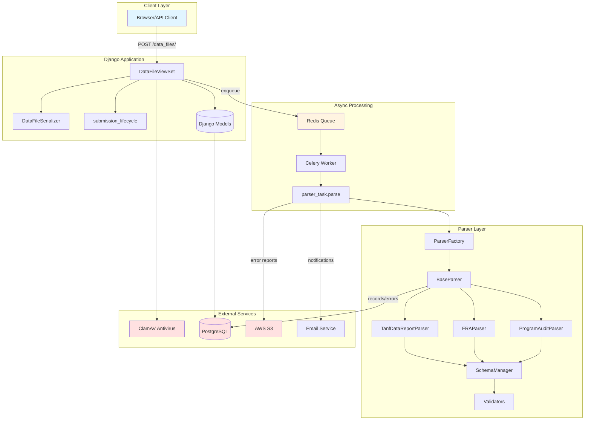
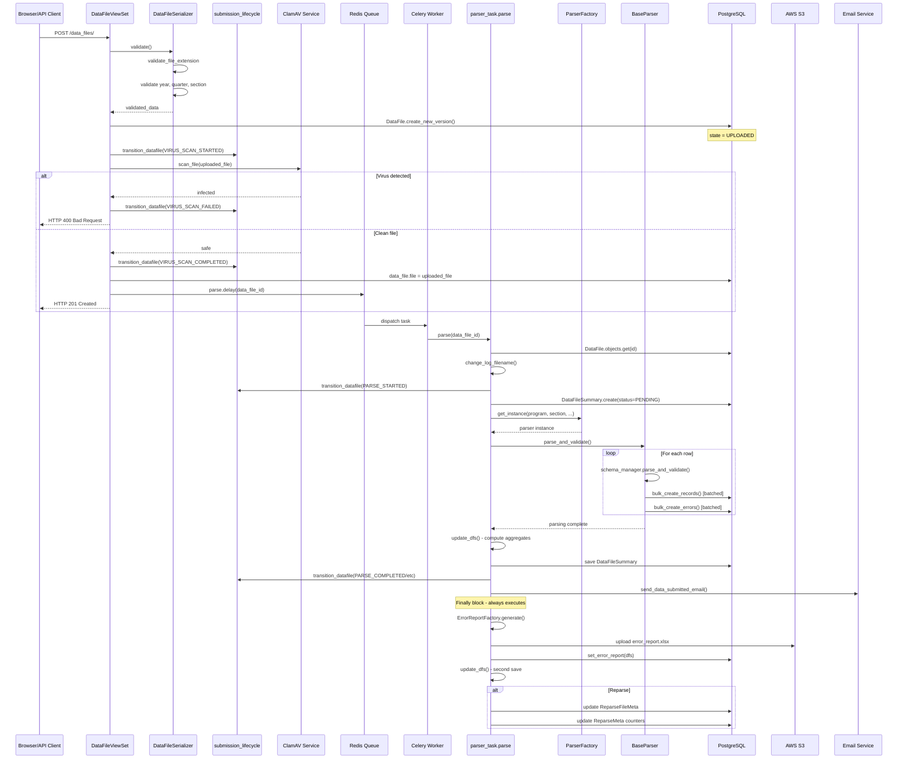
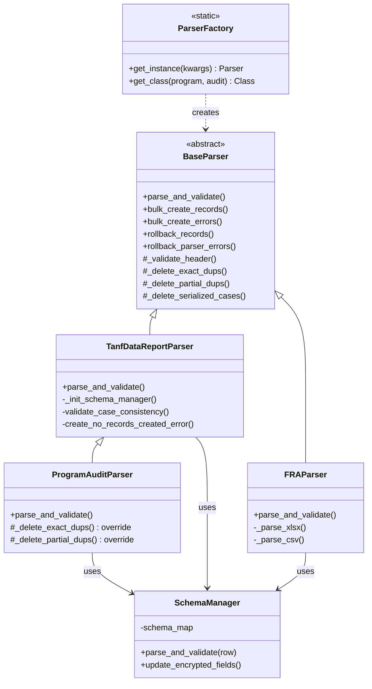
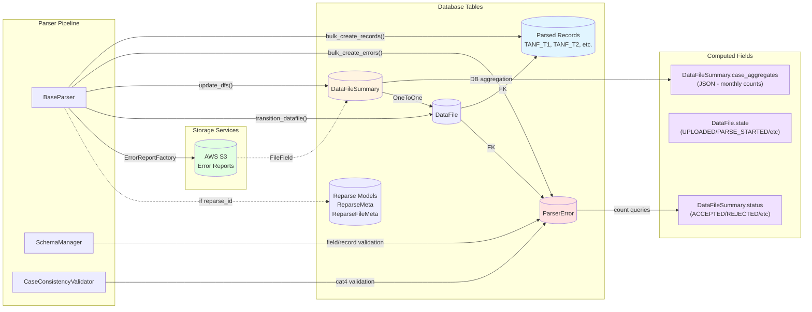
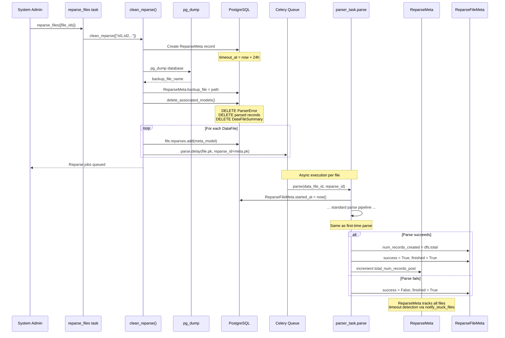

# Parsing & Reparsing Architecture

**Status:** Internal reference documentation  
**Scope:** `tdrs-backend/tdpservice` — Django backend + Celery workers  
**Last updated:** 2026-04-29

---

## Table of Contents

1. [Overview](#1-overview)
2. [End-to-End Upload → Parse Flow](#2-end-to-end-upload--parse-flow)
3. [ParserFactory: Selection & Invocation](#3-parserfactory-selection--invocation)
4. [Schema Validation: SchemaManager & Validators](#4-schema-validation-schemamanager--validators)
5. [Output Storage: Source-of-Truth Map](#5-output-storage-source-of-truth-map)
6. [Error Report Generation & Notifications](#6-error-report-generation--notifications)
7. [Reparsing Flow](#7-reparsing-flow)
8. [Retry / Rollback Behavior](#8-retry--rollback-behavior)
9. [Known Pain Points & Refactor Hazards](#9-known-pain-points--refactor-hazards)

---

## 1. Overview

TDP accepts data file submissions from state/tribal STT agencies. Each uploaded file goes through:

1. **AV (antivirus) scanning** — ClamAV validates the file is not infected.
2. **Parsing & validation** — a Celery task decodes, validates, and stores structured records.
3. **Error reporting** — an Excel error report is generated and stored in S3.
4. **Email notification** — submitting Data Analysts receive a summary email.

The same `parse` Celery task handles both first-time parses and admin-triggered **reparsing** via the `reparse_id` parameter.

There are two status concepts in the current implementation:

- `DataFile.state` tracks submission lifecycle state (state machine), from upload through virus scan, parse start, and parse outcome.
- `DataFileSummary.status` tracks parser outcome (`Accepted`, `Rejected`, etc.) and is the field used by parser emails and error-report views.

### System Architecture



---

## 2. End-to-End Upload → Parse Flow

### Sequence Diagram

> **Mermaid Sequence Diagram Keywords:**
> - `alt` / `else` — Alternative paths (if/else branching)
> - `loop` — Repeated actions
> - `opt` — Optional steps that may or may not execute
> - `par` — Parallel execution



### Text-Based Flow

```
Browser / API Client
        │
        ▼
POST /data_files/                         (DataFileViewSet.create)
        │
        ├── DRF serializer validation     (DataFileSerializer.validate)
        │       ├── DRF/model field validation for year, quarter, section, stt, and user
        │       └── validate_file_extension
        │
        ├── DataFileSerializer.create()
        │       ├── sets program_type from SSP / Tribal / FRA / TANF inputs
        │       └── DataFile.create_new_version(...) creates the DataFile with file=None (state = UPLOADED)
        │
        ├── transition_datafile → VIRUS_SCAN_STARTED
        ├── ClamAVClient.scan_file(...)       ← synchronous, in-request scan
        ├── [scan failure] transition_datafile → VIRUS_SCAN_FAILED and return HTTP 400
        ├── transition_datafile → VIRUS_SCAN_COMPLETED
        ├── data_file.file = uploaded_file; data_file.save()
        │
        └── parser_task.parse.delay(data_file_id)   ← enqueued to Celery/Redis
                │
                ├── HTTP 201 response returned after task is queued
                └── [asynchronous worker execution]
                ▼
        [Celery Worker] parse(data_file_id, reparse_id=None)   (parser_task.py)
                │
                ├── DataFile.objects.get(id=data_file_id)
                ├── change_log_filename(logger, data_file)      ← per-file log rotation
                ├── transition_datafile → PARSE_STARTED
                ├── DataFileSummary.objects.create(status=PENDING)
                │
                ├── ParserFactory.get_instance(...)             ← selects parser class
                │       └── parser.parse_and_validate()         ← core parsing loop
                │
                ├── update_dfs(dfs, data_file)                  ← computes case_aggregates
                ├── transition_datafile → PARSE_COMPLETED / PARSED_WITH_ERRORS / PARSE_FAILED
                │
                ├── send_data_submitted_email(dfs, recipients)  ← emails Data Analysts when applicable
                │
                └── [finally block]
                        ├── ErrorReportFactory.get_error_report_generator(data_file).generate()
                        ├── set_error_report(dfs, error_report)  ← stores .xlsx in S3
                        ├── logger.handlers[2].doRollover(data_file)
                        ├── update_dfs(dfs, data_file)           ← second save (see §9)
                        └── [if reparse_id] update ReparseFileMeta + ReparseMeta counters
```

### Key modules and their roles

| Module | Path | Role |
|---|---|---|
| `DataFileViewSet` | `data_files/views.py` | HTTP entry point; transitions state; enqueues parse task |
| `DataFileSerializer` | `data_files/serializers.py` | DRF validation including file extension and FRA access checks |
| `submission_lifecycle` | `data_files/submission_lifecycle.py` | State machine helpers; enforces `ALLOWED_TRANSITIONS` |
| `parser_task.parse` | `scheduling/parser_task.py` | Celery task; orchestrates the entire parse pipeline |
| `ParserFactory` | `parsers/factory.py` | Selects and instantiates the correct parser class |
| `BaseParser` | `parsers/parser_classes/base_parser.py` | Shared decode → bulk-create → rollback logic |
| `SchemaManager` | `parsers/schema_manager.py` | Maps record types to `RowSchema` instances |
| `ErrorReportFactory` | `data_files/error_reports.py` | Builds per-file Excel error reports |
| `send_data_submitted_email` | `email/helpers/data_file.py` | Sends parse-result email to Data Analysts |

---

## 3. ParserFactory: Selection & Invocation

**File:** `tdrs-backend/tdpservice/parsers/factory.py`

### Parser Class Hierarchy



### Selection Logic

```
ParserFactory.get_instance(**kwargs)
        │
        ├── pops program_type, is_program_audit from kwargs
        └── calls get_class(program_type, is_program_audit)
                │
                ├── TANF | SSP | TRIBAL + PROGRAM AUDIT          →  ProgramAuditParser
                ├── TANF | SSP | TRIBAL                          →  TanfDataReportParser
                └── FRA                                          →  FRAParser
```

All three parsers inherit from `BaseParser` (ABC).

### Parser class responsibilities

| Class | Path | Used for |
|---|---|---|
| `TanfDataReportParser` | `parsers/parser_classes/tdr_parser.py` | TANF, SSP-MOE, Tribal TANF Active/Closed/Aggregate/Stratum sections |
| `FRAParser` | `parsers/parser_classes/fra_parser.py` | FRA Work Outcome / TANF Exiters (XLSX or CSV) |
| `ProgramAuditParser` | `parsers/parser_classes/program_audit_parser.py` | Program Integrity Audit (PIA) submissions |

`ProgramAuditParser` inherits the TANF parser loop but swaps in program-audit header/trailer schemas and overrides duplicate handling so duplicates generate errors without deleting records.

### `parse_and_validate` high-level loop (TanfDataReportParser)

```
_validate_header()
    └── fails fast → returns without persisting anything

_init_schema_manager(program_type)          ← builds SchemaManager
schema_manager.update_encrypted_fields(...)

for row in decoder.decode():
    ├── detect HEADER / TRAILER rows → skip / count
    ├── schema_manager.parse_and_validate(row)   ← returns (record, is_valid, errors)
    ├── case_consistency_validator.add_record(...)
    ├── unsaved_records.add_record(...)
    ├── bulk_create_records()               ← batched DB writes (BULK_CREATE_BATCH_SIZE)
    └── bulk_create_errors()                ← batched ParserError inserts

[after loop]
validate_case_consistency()
bulk_create_records(flush=True)
_delete_exact_dups()
_delete_partial_dups()
_delete_serialized_cases()                  ← removes records with cat4 consistency errors
create_no_records_created_pre_check_error()
bulk_create_errors(flush=True)
```

---

## 4. Schema Validation: SchemaManager & Validators

**File:** `tdrs-backend/tdpservice/parsers/schema_manager.py`

```
SchemaManager.__init__
    └── ProgramManager.get_schemas(program_type, section, is_program_audit)
            └── returns schema_map: { record_type → [RowSchema, ...] }
                    └── each RowSchema.prepare(datafile) called at init

SchemaManager.parse_and_validate(row)
    └── for each RowSchema in schema_map[row.record_type]:
            schema.parse_and_validate(row)
                ├── preparsing validators  (record/header shape checks)
                ├── field validators       (field-level format/range checks)
                ├── postparsing validators (cross-field / record-level checks, TDR only)
                └── returns (record_obj, is_valid, [ParserError,...])
```

`SchemaManager` catches unknown record types and converts them into `RECORD_PRE_CHECK` parser errors instead of raising out of the parser loop. Case-consistency validation is separate from `SchemaManager`; `TanfDataReportParser` runs `CaseConsistencyValidator` as records are parsed and again after the file loop.

### Error categories

| Category | Enum value | Description |
|---|---|---|
| Pre-check | `PRE_CHECK` | File-level structural problems (bad header, unknown encoding, no records) — causes full REJECTED status |
| Record pre-check | `RECORD_PRE_CHECK` | Record-level structural problems (unknown record type) — causes PARTIALLY_ACCEPTED |
| Field validation | `FIELD_VALUE` | Field format / range errors — causes ACCEPTED_WITH_ERRORS |
| Value consistency | `VALUE_CONSISTENCY` | Post-parse cross-field / record-level validation errors — causes ACCEPTED_WITH_ERRORS unless higher-severity errors exist |
| Case consistency | `CASE_CONSISTENCY` | Cross-record (cat4) inconsistencies — causes PARTIALLY_ACCEPTED; TANF/SSP/Tribal associated case records are deleted, while Program Audit duplicate records are retained |

`FRASchema` uses an internal `ErrorGeneratorType.FRA`, but the generated `ParserError.error_type` is currently stored as `CASE_CONSISTENCY`.

---

## 5. Output Storage: Source-of-Truth Map

### Data Flow Diagram



### What lives where

| Data | Model / Field | Source of truth | Notes |
|---|---|---|---|
| Parsed records (M1/M2/M3 etc.) | Program-specific Django models (e.g., `TANF_T1`) | `BaseParser.bulk_create_records()` | Created via `bulk_create`; keyed to `DataFile` FK |
| Validation errors | `ParserError` | `BaseParser.bulk_create_errors()` | `deprecated=False` for active errors; FK to `DataFile` |
| File-level status | `DataFileSummary.status` | `DataFileSummary.get_status()` | Computed from `ParserError` counts after parse; overridden directly only on exceptions |
| Count of records in file | `DataFileSummary.total_number_of_records_in_file` | Incremented in parser loop | Not authoritative — records can be deleted later by dup/cat4 cleanup |
| Count of records created | `DataFileSummary.total_number_of_records_created` | Updated by `bulk_create_records()` + decremented in `_delete_serialized_cases()` | Used in reparse meta |
| Aggregate / monthly counts | `DataFileSummary.case_aggregates` (JSON) | `update_dfs()` calling `case_aggregates_by_month` / `fra_total_errors` | Computed post-parse via DB aggregation |
| Excel error report | `DataFileSummary.error_report` (S3 file) | `ErrorReportFactory` in `finally` block | Attempted on success and failure; early cleanup crashes can prevent it |
| Submission lifecycle state | `DataFile.state` (`SubmissionState` enum) | `submission_lifecycle.transition_datafile()` | Advanced through upload, virus-scan, parse-start, and parse-outcome states |
| Reparse job progress | `ReparseMeta` + `ReparseFileMeta` | `parser_task.parse` (finally block) + `reparse.py` | Tracks per-file start/finish/success |

There is no separate `DataFile.status` field in the current model. When older tickets or discussions say "DataFile status," they usually mean either `DataFile.state` for submission lifecycle or `DataFileSummary.status` for parser outcome.

---

## 6. Error Report Generation & Notifications

### Error report flow

```
[finally block in parser_task.parse]
        │
        └── ErrorReportFactory.get_error_report_generator(data_file)
                │
                ├── Active/Closed section     →  ActiveClosedErrorReport   (2-sheet XLSX)
                ├── Aggregate/Stratum section  →  AggregateStratumErrorReport
                └── FRA section               →  FRADataErrorReport        (1-sheet XLSX)
                        │
                        └── .generate()
                                ├── queries ParserError.objects.filter(file=datafile, deprecated=False)
                                ├── writes rows to xlsxwriter workbook
                                └── returns BytesIO

set_error_report(dfs, error_report)
        └── DataFileSummary.error_report = File(...)   ← triggers S3 upload on .save()
```

The error report is **attempted** in the `finally` block regardless of parse success or failure. If `data_file` or `dfs` was not created due to a very early failure, the cleanup path can raise a secondary exception instead of writing the report (see §9.1).

### Email notification flow

```
[after parser.parse_and_validate() succeeds — NOT in finally]
        │
        └── send_data_submitted_email(dfs, recipients)
                │
                ├── queries User.objects.filter(
                │       stt=data_file.stt,
                │       account_approval_status=APPROVED,
                │       groups__name="Data Analyst"
                │   )
                ├── further filters FRA files by user_permissions has_fra_access
                └── automated_email(template, subject, context, recipients)
```

For first-time parses, emails are sent to approved Data Analysts for the submitting STT after `update_dfs()` computes the final `DataFileSummary.status`.

For reparses, notification is conditional. `parser_task.should_send_reparse_notification(...)` suppresses the email when the previous summary status was `ACCEPTED` and the reparsed status remains `ACCEPTED`; otherwise reparses use the reprocessed email templates and call `send_data_submitted_email(..., is_reprocessed=True)`. The email helper also returns without sending if `dfs.status == PENDING`; normal success paths call `update_dfs()` before email, while exception paths skip the email call entirely.

### Logging and audit trail

- `transition_datafile()` logs each upload/virus-scan state transition with `data_file_id`, previous state, next state, and note.
- `parser_task.parse` calls `change_log_filename(logger, data_file)` so parser logs are associated with the data file, then rolls over the file handler in the `finally` block.
- Parser internals use `log_parser_exception(...)` for parser-specific failures, including decode, bulk-create, and rollback errors.
- `send_data_submitted_email(...)` writes an audit-style log entry through `tdpservice.core.utils.log(...)` with `user_id`, `object_id`, `object_repr`, and `content_type`.
- Reparse setup and cleanup paths log through `tdpservice.core.utils.log(...)` using the `system` user context; selected utility paths also write Django admin `LogEntry` rows, for example when a reparse-selected file has no `DataFileSummary`.

---

## 7. Reparsing Flow

Reparsing is triggered via:
- **Admin management command:** `clean_and_reparse` (not shown here)
- **Admin Celery task** (`data_files/tasks.py`): `reparse_files(file_ids)` → `reparse.clean_reparse()`

### Reparse Sequence Diagram



### Scheduled monitoring: `notify_stuck_files`

**File:** `tdrs-backend/tdpservice/data_files/tasks.py`

A Celery beat task `notify_stuck_files` runs on a schedule and detects files stuck in `PENDING`:

```
notify_stuck_files()
        │
        └── get_stuck_files()
                │
                ├── non-reparse submissions > 1 hour old with no DataFileSummary or PENDING status
                └── reparse submissions past timeout_at with finished=False and success=False
                        │
                        ▼
                [if any stuck files found]
                        └── send_stuck_file_email(stuck_files, OFA_System_Admin_recipients)
```

This is the **only automated signal** that a parse job has silently stalled. There is no auto-retry — a human must inspect and trigger `reparse_files`.

### `reparse_files` Celery task

`reparse_files(file_ids)` is the Celery entry point for admin-triggered reparsing. It converts the list of IDs to a comma-separated string and calls `clean_reparse([file_ids_str])`. The `clean_reparse` function itself is plain Python (not a task).

```
reparse_files(file_ids)                   (data_files/tasks.py)
        └── clean_reparse(["id1,id2,..."]) (search_indexes/reparse.py)
```

```
clean_reparse(selected_file_ids)          (search_indexes/reparse.py)
        │
        ├── creates ReparseMeta record    ← tracks the whole batch
        ├── backup(backup_file_name)       ← pg_dump of the Postgres DB
        ├── delete_associated_models(...)  ← deletes existing ParserErrors, records, DataFileSummary
        └── handle_datafiles(files, meta_model, ...)
                └── for each DataFile:
                        ├── file.reparses.add(meta_model)
                        └── parser_task.parse.delay(file.pk, reparse_id=meta_model.pk)
                                │
                                ▼
                        [Celery Worker] parse(data_file_id, reparse_id=...)
                                ├── ReparseFileMeta.started_at = now(); save()
                                ├── ... (same parse pipeline as §2) ...
                                └── [finally]
                                        ├── file_meta.num_records_created = dfs.total_number_of_records_created
                                        ├── file_meta.cat_4_errors_generated = ParserError cat4 count
                                        ├── ReparseMeta.set_total_num_records_post(...)
                                        └── set_reparse_file_meta_model_state(reparse_id, file_meta, success)
```

### Reparse-specific models

| Model | Purpose |
|---|---|
| `ReparseMeta` | One row per reparse batch; tracks totals, backup path, timeout |
| `ReparseFileMeta` | One row per (DataFile × ReparseMeta); tracks per-file start/finish/success and record counts |

---

## 8. Retry / Rollback Behavior

### Celery retry policy

`parser_task.parse` has **no `autoretry_for` or `max_retries` configuration**. If the task crashes, Celery will **not** automatically retry it. Resubmission (reparsing) must be triggered manually by an admin.

### In-task rollback

Two manual rollback helpers exist in `BaseParser`:

| Method | What it does |
|---|---|
| `rollback_records()` | Deletes all records for `self.datafile` from each model type using `_raw_delete` |
| `rollback_parser_errors()` | Deletes all `ParserError` rows for `self.datafile` using `_raw_delete` |

Rollback is called when:
- Multiple headers are detected mid-file.
- No header is detected after the parser loop.
- `bulk_create_records()` returns `False` (DB error on final flush).

Rollback is **not** called when an unexpected `Exception` is raised at the `parser_task.parse` level — only a generic user-visible `ParserError` is created and `dfs.status` is set to `REJECTED`.

If the parser finishes without creating records, `create_no_records_created_pre_check_error()` adds a `PRE_CHECK` error, but it does not itself roll back records.

### Idempotency assumptions

- The `parse` task assumes the `DataFileSummary` for a given `DataFile` does **not** already exist — `DataFileSummary.objects.create()` will raise `IntegrityError` if called twice for the same file (OneToOneField).
- Reparsing calls `delete_associated_models()` before re-queuing, which removes the old `DataFileSummary`, all `ParserError` rows, and all parsed record rows. This gives a reparse batch a clean starting point, but it does **not** make the Celery parse task itself idempotent if the same task is delivered twice after cleanup.
- **No database transaction wraps the entire parse**. Records are bulk-inserted mid-loop and only partially rolled back on some failure paths. A crash during parsing can leave partial records; a crash in the `finally` block can leave the error report or reparse metadata incomplete.

---

## 9. Known Pain Points & Refactor Hazards

### 9.1 Early `DataFile` lookup failure can crash cleanup

**Location:** `scheduling/parser_task.py` (finally block)

`dfs` is initialized to `None`, and helper paths now guard before calling `dfs.set_status()` or generating the error report. However, `data_file` and `file_meta` are still assigned inside the `try` block. If `DataFile.objects.get(id=data_file_id)` raises before either value is bound, the `finally` block still calls `_finalize_parse(data_file, dfs)` and `_finalize_reparse(..., file_meta, ...)`, which can raise `UnboundLocalError`.

If `DataFileSummary.objects.create()` fails after `data_file` is bound, `dfs` remains `None`; `_finalize_parse` and `_finalize_reparse` return early and avoid the older `dfs`/`file_meta` cleanup crash.

**Risk:** A missing or inaccessible `DataFile` can turn the original failure into a cleanup failure, obscuring the root cause.

### 9.2 Hardcoded logger handler index

**Location:** `scheduling/parser_task.py` (`_finalize_parse`)

```python
logger.handlers[2].doRollover(data_file)
```

This assumes `handlers[2]` is the per-file rotating handler. If the logging configuration changes (reorder, add handler, different environment), this silently fails or crashes.

### 9.3 `update_dfs` called twice in every parse

`update_dfs(dfs, data_file)` is called once after `parse_and_validate()` succeeds **and** again unconditionally in the `finally` block. The second call invokes `dfs.get_status()`, which short-circuits to the manually-set value when `status != PENDING` — so exception paths that explicitly call `dfs.set_status(REJECTED)` (e.g., `DecoderUnknownException`, bare `Exception`) are correctly preserved.

The real hazard is the `DatabaseError` path: it logs the error and sets `reparse_success = False` but **never calls `dfs.set_status()`**, leaving `dfs.status` as `PENDING`. The second `update_dfs` in the `finally` block then re-queries `ParserError` counts via `get_status()` and may compute and save `ACCEPTED` or `ACCEPTED_WITH_ERRORS`, masking a partial DB failure with a misleading success status.

### 9.4 AV scan is synchronous and in-request

The ClamAV scan runs synchronously inside `DataFileViewSet.create()` after serializer validation creates a `DataFile` row with `file=None`. State transitions (`VIRUS_SCAN_STARTED` → `VIRUS_SCAN_COMPLETED` or `VIRUS_SCAN_FAILED`) are recorded before the API returns. This means AV scan latency is directly exposed to the user and cannot be independently retried, although unsafe files are not persisted to storage or submitted for parsing.

### 9.5 No transaction boundary around the parse pipeline

Records are bulk-created in batches mid-parse. A crash partway through leaves partial records in the DB. `rollback_records()` is called in some error paths but **not** wrapped in `django.db.transaction.atomic()`. If rollback itself fails, orphaned records persist.

### 9.6 `clean_reparse` race condition on sequential execution check

**Location:** `search_indexes/reparse.py` — `assert_sequential_execution()`

There is a check to prevent concurrent reparse jobs, but it is not DB-level atomic. Two concurrent admin triggers could both pass the check and create overlapping `ReparseMeta` jobs.

### 9.7 `int(request.data.get("year"))` — unguarded cast

**Location:** `data_files/views.py` (PIA feature flag branches)

`request.data.get("year")` can return `None` or a non-numeric string; `int()` will raise `TypeError` or `ValueError` without a try/except, producing a 500 rather than a 400.

### 9.8 `DataFileSummary.status` has two writers with different semantics

- `get_status()` computes status from `ParserError` counts (query-driven).
- `set_status(status)` overrides status directly (exception-driven).
- `get_status()` short-circuits to return the manually-set value if `status != PENDING`, but this relies on the caller having set PENDING as the initial state. If the PENDING default is ever changed, the guard logic breaks.

### 9.9 Parse lifecycle state and summary status both describe outcomes

`parser_task.parse` transitions `DataFile.state` to `PARSE_STARTED` and then to `PARSE_COMPLETED`, `PARSED_WITH_ERRORS`, or `PARSE_FAILED` based on `DataFileSummary.status`. This creates two parallel status concepts: `DataFile.state` for lifecycle and `DataFileSummary.status` for parser outcome and user-facing email/report behavior. Refactors should preserve the mapping between them or explicitly choose which one is authoritative for each use case.

### 9.10 Email is sent before the error report is written

`send_data_submitted_email` is called after `parser.parse_and_validate()` but before the `finally` block writes the error report to S3. If the user immediately clicks the email link, `DataFileSummary.error_report` may not yet be populated.

### 9.11 Reparse notification is conditional

Admin-triggered reparsing calls the same email helper with `is_reprocessed=True`, but `should_send_reparse_notification(...)` suppresses notifications when the previous status was `ACCEPTED` and the reparsed status remains `ACCEPTED`. Other reparse outcomes can send action-required or errors-resolved emails using the reparse templates.
