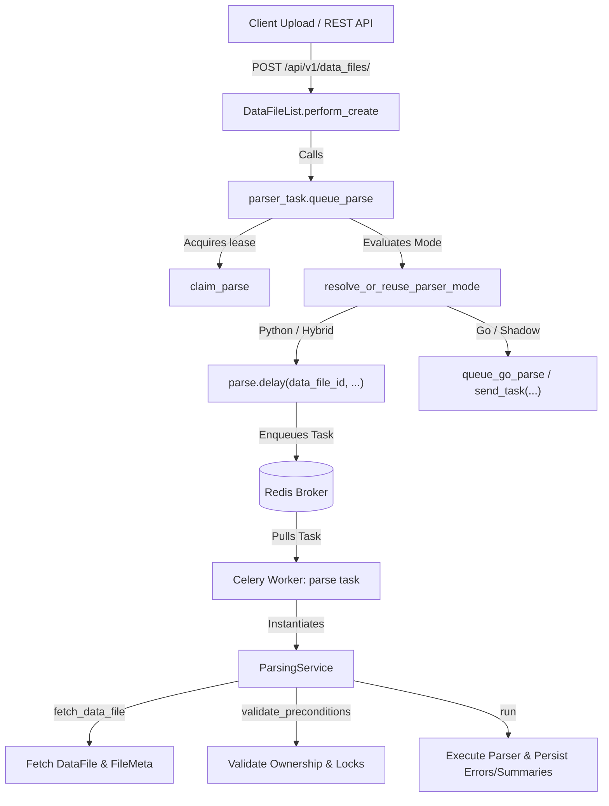

# Celery and Asynchronous Parser Execution Architecture (Issue #5571)

This document explains the Celery task definitions, asynchronous queuing flow, and execution model for the TANF Data Portal parsing subsystem following the refactor to `ParsingService` in [Issue #5571](https://github.com/raft-tech/TANF-app/issues/5571).

---

## 1. Overview & Architecture



---

## 2. Celery Task Definitions

Located in [`tdpservice/scheduling/parser_task.py`](../scheduling/parser_task.py):

### `parse` (Python Celery Task)
* **Decorator:** `@shared_task`
* **File Location:** [`tdpservice/scheduling/parser_task.py`](../scheduling/parser_task.py)
* **Role:** A lightweight Celery entrypoint that delegates orchestration and execution logic to `ParsingService`:
```python
@shared_task
def parse(data_file_id, reparse_id=None, parse_token=None, event_id=None):
    """Send data file for processing."""
    data_file = DataFile.objects.get(id=data_file_id)
    service = ParsingService(
        data_file=data_file,
        reparse_id=reparse_id,
        parse_token=parse_token,
        event_id=event_id,
    )
    result = service.run()
    if not result.success and (
        result.data_file is None
        or (service.parse_token is None and not _uses_shadow_table(result.data_file))
    ):
        if result.error_message:
            raise ValueError(result.error_message)
        raise RuntimeError("Parsing failed before ownership establishment")
    return result
```

### `go_parse` (Go Parser Celery Task)
* **Decorator:** `@shared_task(name=GO_PARSER_TASK_NAME)`
* **File Location:** [`tdpservice/scheduling/parser_task.py`](../scheduling/parser_task.py)
* **Role:** Registered in Celery so task routing can forward jobs to the standalone Go parser worker.

### `post_parse` (Go Post-Parse Celery Task)
* **Decorator:** `@shared_task(name=GO_PARSER_POST_PARSE_TASK_NAME)`
* **File Location:** [`tdpservice/scheduling/parser_task.py`](../scheduling/parser_task.py)
* **Role:** Handles status transitions, error reporting, and audit logs after a Go parser worker finishes by delegating to `ParsingService.post_parse(...)`.

---

## 3. Asynchronous Dispatch & Enqueuing

### `queue_parse(...)`
* **File Location:** [`tdpservice/scheduling/parser_task.py` (lines 223–274)](../scheduling/parser_task.py#L223-L274)
* **Role:** Coordinates task dispatching:
  1. Resolves/persists the parser routing mode (`PYTHON_ONLY`, `GO_SHADOW`, or `GO_ONLY`).
  2. Acquires a durable parse ownership token via `claim_parse(...)`.
  3. Enqueues the Celery task asynchronously using `.delay(...)`:
     ```python
     parse.delay(
         data_file_id,
         reparse_id=reparse_id,
         parse_token=str(parse_token),
         event_id=event_id,
     )
     ```
  4. Dispatches to `queue_go_parse(...)` if in Go mode.

### `queue_go_parse(...)`
* **File Location:** [`tdpservice/scheduling/parser_task.py` (lines 180–222)](../scheduling/parser_task.py#L180-L222)
* **Role:** Sends messages directly to the Go parser queue via `current_app.send_task(GO_PARSER_TASK_NAME, ...)`.

---

## 4. Entry Points Triggering Asynchronous Parses

1. **File Uploads via REST API:**
   * **Location:** [`tdpservice/data_files/views.py` (line 261)](../data_files/views.py#L261)
   * **Method:** `DataFileList.perform_create`
   * **Invocation:**
     ```python
     parser_task.queue_parse(data_file.id, event_id=event_id)
     ```

2. **Reparsing Management Commands & Reparse Meta:**
   * **Location:** [`tdpservice/search_indexes/reparse.py` (line 65)](../search_indexes/reparse.py#L65)
   * **Invocation:**
     ```python
     parser_task.queue_parse(
         data_file_id=df_id,
         reparse_id=reparse_id,
         event_id=event_id,
     )
     ```

---

## 5. Runtime Execution: Production vs. Unit Tests

| Environment | Dispatch Mechanism | Execution Model |
| :--- | :--- | :--- |
| **Production / Docker** | `parse.delay(...)` / `queue_parse(...)` | **Asynchronous:** Sent over Redis message broker to background Celery worker container (`celery -A tdpservice worker`). |
| **Unit Tests** | `parser_task.parse(...)` or `ParsingService.run()` | **Synchronous:** Executed directly in the test thread to verify database state transitions, side effects, and error reporting deterministically without requiring an active message broker. |
