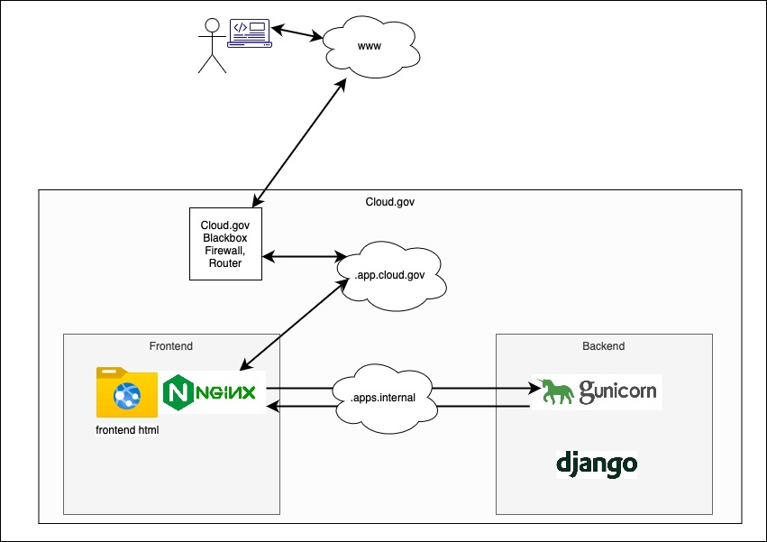

# Nginx Documentation

## 1. Installation

The Nginx uses a master process and mutiple workers to efficiently manage requests. The master process reads and evaluates config file and manages the workers. 

In TDRS, all config and associated files with it are placed in ```/tdrs-frontend/nginx``` folder. There are various differences between the local and deployed versions. Due to the fact that cloud.gov uses buildpacks and local version uses containerized docker instance, there are two separate directories for local and deployed versions.

## 2. Architecture

In general for TDRS, the *Nginx* handles incoming HTTP requests to both frontend and backend. The frontend requests are handled directly while the backend requests are forwarded to the backend server.



*Nginx* serves the frontend built files placed in *```/usr/share/nginx/html```* which ensures not  only the static files are served efficiently, the security headers area added as defined in the conf file.

- HTTP requests are first handled by Cloud.gov (.app.cloud.gov subnet) and then routed to frontend instance which has Nginx service.
- Nginx serves frontend requests directly and routes backend api requests to backend server.
- The backend requests are distinguished by their specific URI.

The Nginx configuration files are located in: *'/frontend/nginx/'*

### Whitelist IPs
A list of IP addresses has been added to ```ip_whitelist.conf```. This means any request from an ip address not in the subnets from file will be rejected. This list is created manualy and needs to be maintained to whitelist and include user IP subnets.

### Security Headers
All security headers following the best practices from [Mozilla](https://developer.mozilla.org/en-US/docs/Web/HTTP/Headers) and [OWASP](https://owasp.org/www-project-secure-headers/) are added with comments on the config files.

##### CORS 

Cross-Origin Resource Sharing (CORS) header allows a server to indicate any origin such as domain or port other than its own from which a browser can load resources. By adding HTTP headers that let server know which origins are permitted to read that information from the web browser. It should be noted that request might be passed without implications on CORS, this includes most form requests.  

The frontend has to send requests to the backend server. The backend then checks the request origin and verifies that the request is coming from an origin existing in the list and consequently adds CORS header.

The backend uses [django-cors-headers](https://github.com/adamchainz/django-cors-headers) to add CORS headers which allow the response to be accessed on other domains. The list of accepted domains are defined in settings file using ```CORS_ALLOWED_ORIGINS```


## Backend

### Nginx

The frontend then sends processing requests to the *backend* Django server, which are handled by *[gunicorn](https://gunicorn.org)*. See section below [Gunicorn](###Gunicorn).

### Gunicorn

Gunicorn is based on python and uses **worker [Worker Processes](https://docs.gunicorn.org/en/stable/design.html#choosing-a-worker-type)**. The number of workers is relative to server request load. 

With having workers responding to requests in Gunicorn, it is importnat to have Nginx in front to handle requests first, otherwise DDOS attacks would consume the server (See Nginx config ??).

Gunicorn by default uses **[Sync worker](https://docs.gunicorn.org/en/latest/design.html#sync-workers)**. This is the most basic worker with some implications. Sync does not support persistent connections, which is the case in our application.
```python
# The number of worker processes for handling requests
workers = 2
```

### Local vs Prod/Deployed

## Security

## Links

